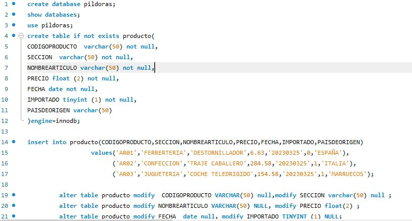
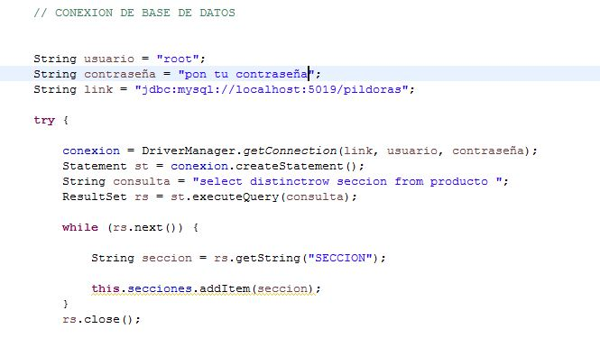
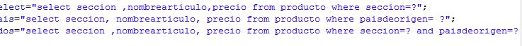
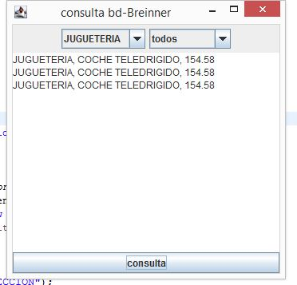

# **ConsultasBD-java** 🐬 ☕
## El archivo `sql.sql` contiene la base de datos con una entidad llamada producto para ejecutar en  Mysql-WorkBench,
## se le realizaran las consultas desde ` AplicacionConsulta.java ` utilizando un IDE. 

___

___

## en ` AplicaiconConsulta.java ` encontraras la conexion a la base de datos con el driver mysql, 
## recordar cambiar usuario , contraseña y puerto que tengas en tu gestor;

___

## las consultas  preparadas son: 

___

## un ejemplo al utilizar  la primera consulta   con ` AplicacionConsulta.java ` seria: 

___

## esta consulta muestra la seccion, NombreArticulo y Precio de la entidad producto.

